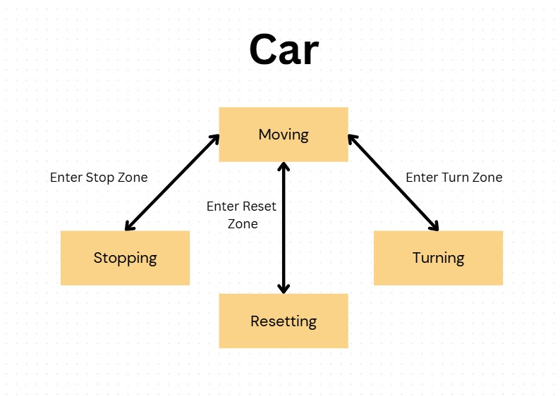
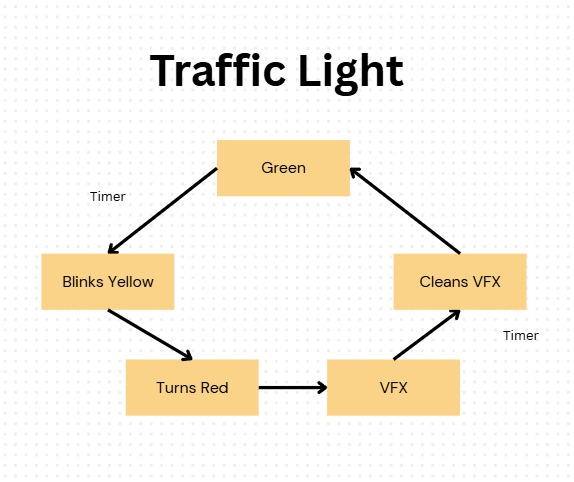
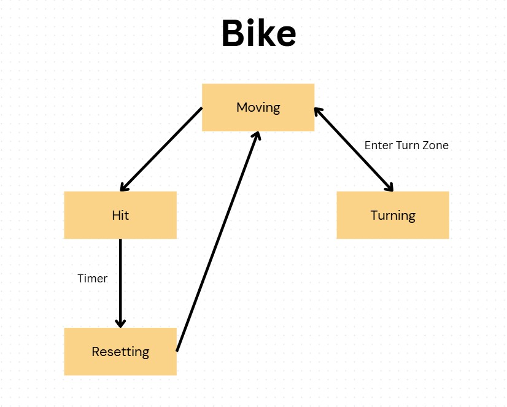
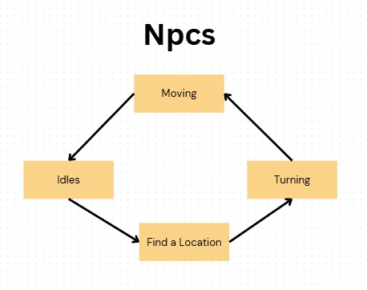
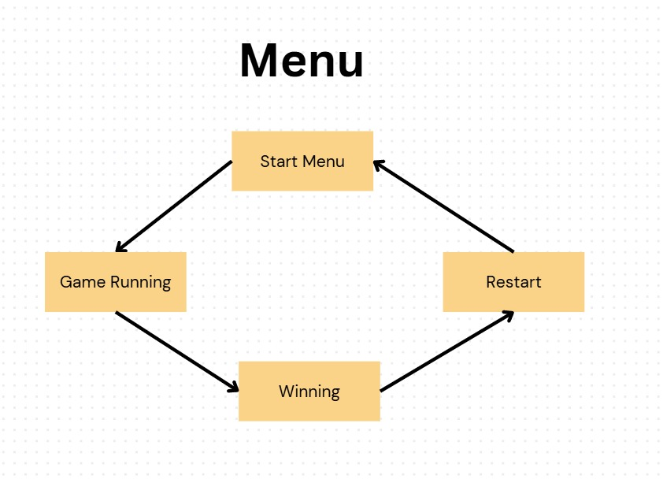

# Rush-Hour_IP

## 🎮 Game Overview
This game is a road-crossing game where the goal is to reach your destination without taking damage from cars and bicycles.

## 🛠️ Installation Guide
1. Download and install Unity from https://unity.com/download
2. Download and install GitHub Desktop from https://github.com/apps/desktop
3. In GitHub Desktop
    1. Go to File -> Clone Repository -> URL
    2. Input the URL https://github.com/CheangWeiCheng/Rush-Hour_IP.git
    3. Choose your local path
    4. Click Clone.
4. In Unity Hub:
    1. Select "Open" → "Add project from disk"
    2. Navigate to the cloned repository folder
5. Ensure these packages are installed:
    1. Input System (Window > Package Manager)
    2. Cinemachine (for camera controls)

## 🖥️ System Requirements
Platform: Windows (Android and iOS planned in future)

| Component      | Recommended                                   |
|----------------|-----------------------------------------------|
| **OS**         | Windows 11 64-bit                             |
| **Processor**	 | 1200 Mhz, 14 Core(s), 18 Logical Processor(s) |
| **CPU**        | Intel(R) Core(TM) Ultra 5 125H                |
| **GPU**        | Intel® ARC Graphics                           |
| **RAM**        | 16GB                                          |

## 🕹️ Key Controls
| Action       | Keybind           |
|--------------|-------------------|
| Move         | WASD              |
| Look         | Mouse             |
| Interact     | E                 |

## ⚠️ Known Limitations
### Current Bugs
- Some times, when the player is walking on the zebra crossing before the car has fully left the trigger, the car will stop instead of just continuing to move

## FSM Diagrams

## 📚 Asset Credits
### Scripts
**Car.cs, TrafficLight.cs, ZebraCrossing.cs, PlayerBehaviour.cs, ThirdPersonController.cs, CoinBehaviour.cs**
Written by Cheang Wei Cheng

**Bike.cs**
Written by Chui Yan Zhuo

**NPC.cs**
Written by Groben Tham

**MenuManager.cs**
Written by Jason Koh

### External Assets
**Star collect, damage:**  
*8 Bits Elements*  
https://assetstore.unity.com/packages/audio/sound-fx/8-bits-elements-16848

**Tree models:**  
*Stylized Trees Cartoon: Lowpoly Mobile Pack Free*  
https://assetstore.unity.com/packages/3d/vegetation/trees/stylized-trees-cartoon-lowpoly-mobile-pack-free-251403

**NPC models and animations:**  
*Stylized NPC - Peasant Nolant (DEMO)*  
https://assetstore.unity.com/packages/3d/characters/humanoids/fantasy/stylized-npc-peasant-nolant-demo-252440

## Additional Credits
The scripts PlayerBehaviour.cs and CoinBehaviour.cs were modified from what was provided by my lecturer, Mr Justin Lee.  
Deepseek AI was used at times to optimise the code and fix certain errors. However, it was not used to write the code entirely.  